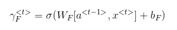
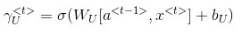
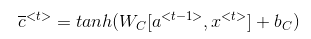
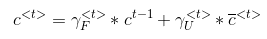
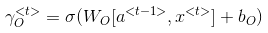
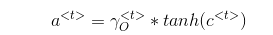

Heyy ya guys! Sorry it took me so long to write this post, was hung up with some courses and deadlines. Anyway, lot's of time on hand now! So I'm gonna resume BLOGGGGING-----GGGGGGGGGGGGG!!!

Excuse the above. Sorry. Lol. So, let's get to it!!
Truth be told, I started reading up about Recurrent Neural Networks when I was faced by the daunting task of actually implementing one for my minor project in college. 
I was like yeah, RNN, I know! Good old chap, hear his name all the time! Umm, but pray what does it do in reality? Haha, yeah I was clueless.

In order to equip myself, I enrolled in the Sequential Models course offered by deeplearning.ai on Coursera! Well, that is one awesome course! I'm totally serious though! Thinking you know something and actually knowing something is actually a very different thing! So I'd suggest you either enroll to the course, audit the content or get yourself a certificate or I guess you'll find the videos on YouTube too!

What are sequential models, you may ask, Well, they are basically nets which either take as input sequential data or give out as output sequential data or both. Sequential data is a glamorous way of saying data which comes in streams or the likes, example: Machine Transaltion where I get a sentence (sequence of words) as input and I give as output a sequence of words translated in another language.

You will learn later that we actually have many different RNN architectures like one-to-one(which isn't very intuitive), one-to-many, many-to-one, and many-to-many. It totally depends on your problem statement which one you want to build.

** Why are Recurrent Neural nets called recurrent??
Well, no point for guessing that one! So, I'm asumming everyone here has understanding of Neural networks, otherwise what are you even doing here fella? Get learnin' about them nets! Sorry about that!!
An RNN has a memory unit called a cell which has the special ability to *remember* (*sparkle*, *sparkle*). Each cell has a choice to either remember the information that it's getting from the previous cells, or forget that and add some new information to be propagated through the network.

It's called recurrent because the output of one cell is the input of the next cell and this can be generalised to view a single cell whose output is it's input. Intuitively, it's learning semantics of a sentence.

The major issue that plagues an RNN is the wretched Vanishing Gradient problem, which in English translated to the problem when the gradients start having very low values during Back Propagation so it becomes difficult to translate the gradient back to the inital layers of the RNN.

In order to overcome this issue, we have 2 specialized RNNs
* LSTM: Long Short Term Memory
* GRU: Gated Recurrent Units

We'll keep our discussion limited to LSTMs for this post.
Long Short Term Memory units are a special type of Recurrent Neural Network.  TheseRecurrent Neural Networks have the specialized ability to retain past information and givethe output accordingly.  It can remember relevant information for a long duration and is therefore a key choice for a classifier.

There are three major gates which govern the functioning of the Recurrent Neural Net-work, namely Forget, Update and Output gate and as the name suggests, the Forget gateuses a binary sigmoid function and outputs either a 0 or 1 value depending on if the pastinformation is to be remembered or not, if not the forget gates takes the values of 1 andthe cell state gets updated by the value of the Update gate, otherwise, the cell state retainsits past value.  A new cell state and final activation is calculated using the tan hyperbolicactivation function.
The key things to keep in mind for an LSTM are, the equations that govern it:

We have 3 major gates:
* Forget Gate: This gate outputs a 0 or 1 value (sigmoid activatio) to indicate whether we have to forget the past state and re-initialize the cell state c.
* Update Gate: This gate outputs a 0 or 1 value (sigmoid activation) to indicate whether we have to update the cell state to the new state.
* Output Gate: This is the output gate, it outputs the cell state after doing some complex math on it and carries it to the next state.
  
I used keras for building my model and that's what I'd suggest to you too! I'll keep updating this with more on RNNs & LSTMs!

Gracias!

